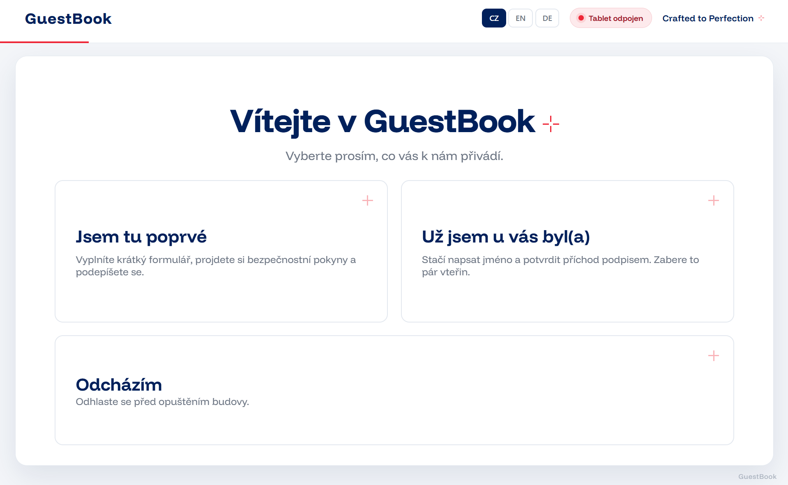
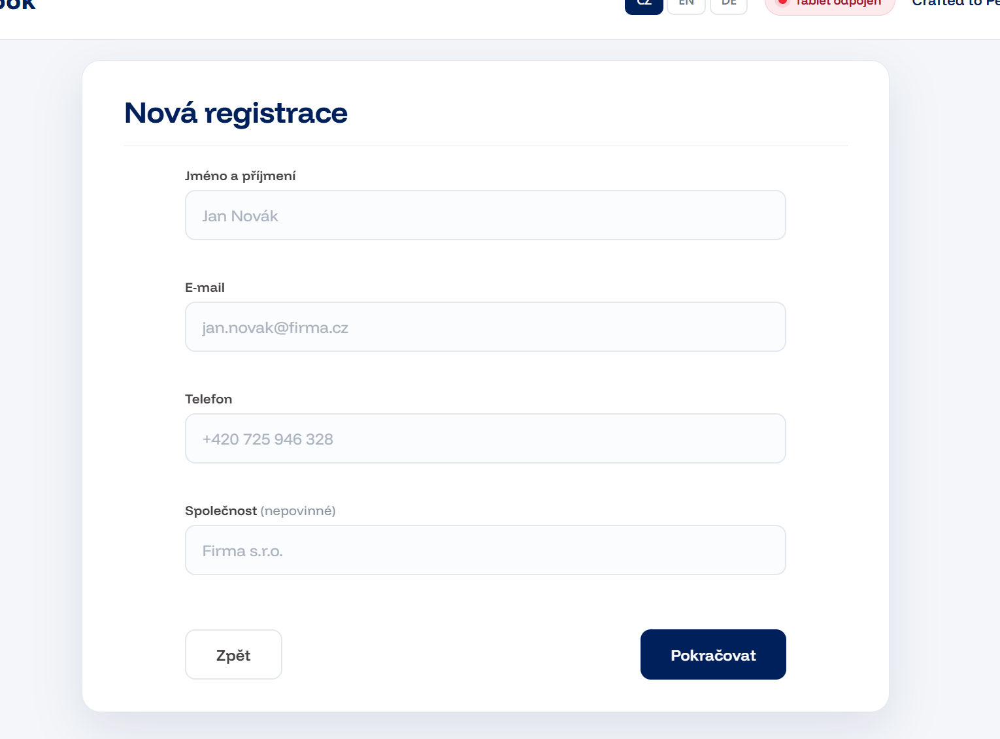
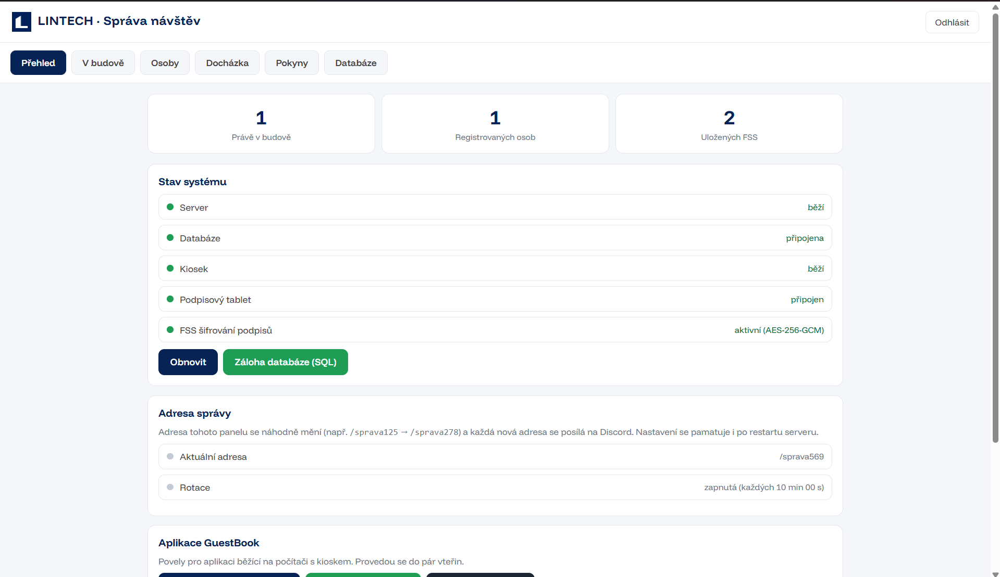
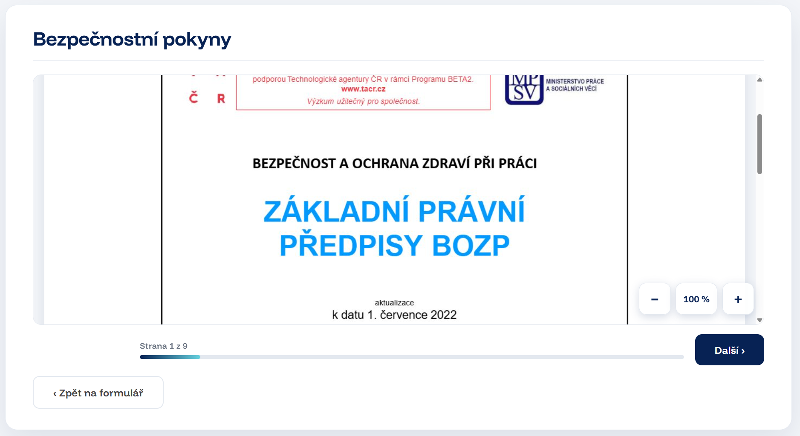
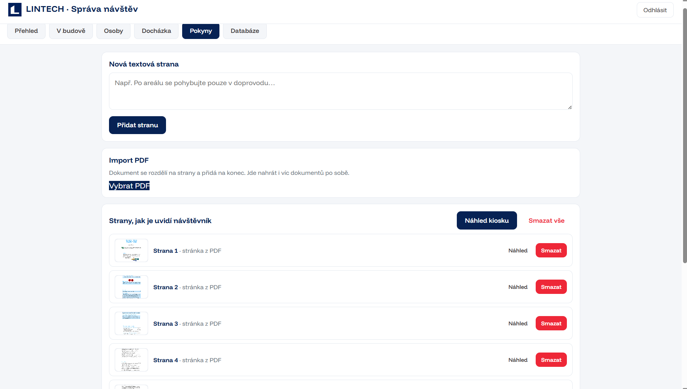
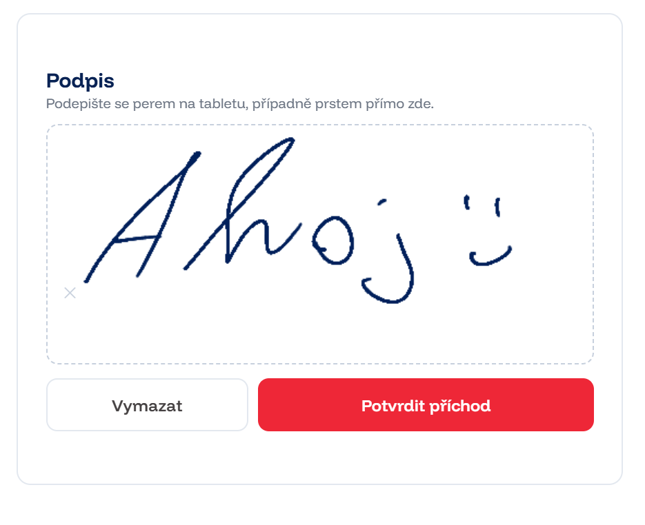
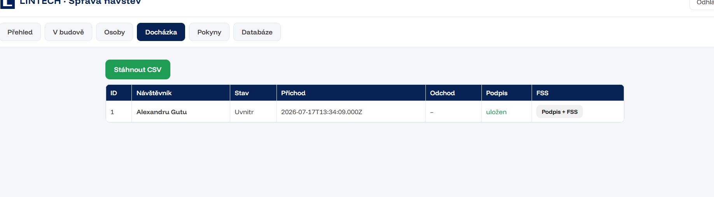
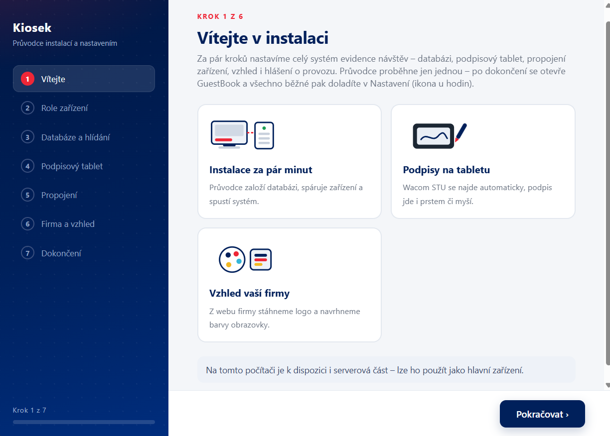
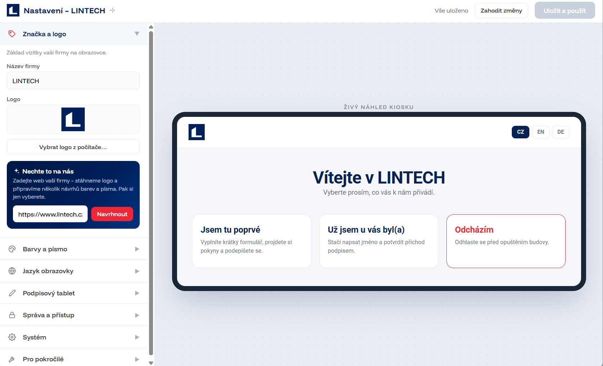
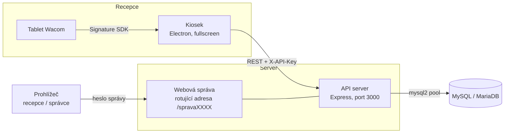

<div align="center">


# GuestBook

**Elektronická kniha návštěv pro recepci** — dotykový kiosek, podpisový tablet Wacom a webová správa v jedné aplikaci.


[Instalace](#instalace) · [Sestavení ze zdrojáků](#sestavení-ze-zdrojáků) · [Konfigurace](#konfigurace) · [Webová správa](#webová-správa) · [Řešení potíží](#řešení-potíží)

</div>

---



Návštěvník přijde na recepci, na dotykové obrazovce se zaregistruje (nebo se vyhledá, pokud už tu někdy byl), projde si bezpečnostní pokyny firmy a podepíše se — prstem na obrazovce, nebo na podpisovém tabletu Wacom. Recepce a správce mají k dispozici webovou administraci: vidí, kdo je zrovna v budově, exportují docházku, upravují pokyny a vzhled kiosku, a v případě potřeby se dostanou přímo k databázi.

## Obsah

- [Hlavní funkce](#hlavní-funkce)
- [Screenshoty](#screenshoty)
- [Architektura](#architektura)
  - [Role zařízení](#role-zařízení)
  - [Jak spolu části komunikují](#jak-spolu-části-komunikují)
- [Instalace](#instalace)
  - [Instalační průvodce krok za krokem](#instalační-průvodce-krok-za-krokem)
- [Sestavení ze zdrojáků](#sestavení-ze-zdrojáků)
  - [Prerekvizity](#prerekvizity)
  - [Spuštění ve vývojovém režimu](#spuštění-ve-vývojovém-režimu)
  - [Build instalátorů](#build-instalátorů)
- [Konfigurace](#konfigurace)
  - [Kde konfigurace leží](#kde-konfigurace-leží)
  - [app.env — nastavení kiosku](#appenv--nastavení-kiosku)
  - [server.env — nastavení serveru](#serverenv--nastavení-serveru)
  - [Ukázkové konfigurace pro každou roli](#ukázkové-konfigurace-pro-každou-roli)
- [Databáze](#databáze)
- [Webová správa](#webová-správa)
- [Podpisy a šifrování FSS](#podpisy-a-šifrování-fss)
- [Zabezpečení](#zabezpečení)
- [Nasazení na Raspberry Pi](#nasazení-na-raspberry-pi)
- [Struktura projektu](#struktura-projektu)
- [Řešení potíží](#řešení-potíží)
- [Licence](#licence)

## Hlavní funkce

- **Registrace návštěvníků** — jméno, e-mail, telefon a firma přes dotykový formulář. Systém hlídá duplicity: pokud e-mail nebo telefon už v databázi existuje, kiosek návštěvníka navede na variantu „Už jsem u vás byl(a)", kde se jen vyhledá podle jména.
- **Bezpečnostní pokyny** — libovolný počet stran, kterými návštěvník před podpisem prolistuje. Strany jsou buď textové (píšou se přímo ve správě), nebo naimportované z PDF — dokument se při importu rozpadne na jednotlivé strany. PDF strany jdou na kiosku přiblížit tlačítky **− / +** (100–250 %) a rolovat prstem.
- **Podpis** — prstem přímo na obrazovce kiosku, nebo perem na tabletu Wacom. Tablet zároveň ukazuje návštěvníkovi výzvu k podpisu. S platnou licencí Wacom Signature SDK se podpis ukládá i jako **šifrovaný FSS soubor** s biometrickými daty tahu (tlak, rychlost, čas) — právně silnější forma podpisu než pouhý obrázek.
- **Docházka** — každý příchod a odchod se zaznamenává s časem a podpisem. Ve správě je vidět kompletní historie s exportem do CSV a náhledy podpisů.
- **Webová správa** — běží přímo na API serveru, přistupuje se k ní prohlížečem odkudkoli ze sítě. Podrobně v sekci [Webová správa](#webová-správa).
- **Jednotný vzhled** — logo, firemní barvy a texty se nastaví jednou (v průvodci nebo ve správě) a platí pro kiosek i administraci. Změna provedená ve správě se na běžícím kiosku projeví do několika sekund, bez restartu.
- **Vícejazyčný kiosek** — návštěvník si jazyk přepne sám na úvodní obrazovce.
- **Discord notifikace** — volitelně se každý příchod hlásí do zvoleného kanálu přes webhook.
- **Vestavěný terminál** — ze správy se dá otevřít webový terminál na server, u kiosků připojených přes SSH i vzdálený přístup na kiosek.

## Screenshoty

| Kiosek | Správa |
|---|---|
|  |  |
|  |  |
|  |  |
|  |  |

> **Kam se screenshoty:** do složky `docs/screenshots/` pod názvy použitými výše (`kiosek-uvod.png`, `kiosek-formular.png`, `kiosek-pokyny.png`, `kiosek-podpis.png`, `pruvodce.png`, `sprava-prehled.png`, `sprava-pokyny.png`, `sprava-dochazka.png`, `sprava-vzhled.png`, volitelně `logo.png` pro hlavičku). U pokynů vyfoťte otevřenou PDF stranu i se zoom tlačítky vpravo dole, u správy pokynů otevřený dialog *Náhled kiosku* — to jsou funkce, které na první pohled prodávají nejvíc.

## Architektura

Repozitář obsahuje dvě části, které se distribuují jako jedna aplikace:

| Část | Technologie | K čemu je |
|---|---|---|
| **App_ELek** | Electron 42 | Obrazovka kiosku, instalační průvodce, okno nastavení, tray ikona. Umí sama spustit a hlídat API server jako podproces. |
| **API_Server** | Node.js + Express + mysql2 | REST API pro kiosky, práce s MySQL, šifrování FSS podpisů, servírování webové správy. Dá se provozovat i samostatně bez Electronu. |

Při buildu instalátoru se `API_Server` přibalí do Electronu jako *extra resource*, takže koncový uživatel instaluje jediný soubor.

### Role zařízení

Roli vybíráte v instalačním průvodci při prvním spuštění; kdykoli později jde změnit přes `npm run pruvodce` nebo z tray menu.

| Role | Co na zařízení běží | Typické použití |
|---|---|---|
| **Kiosek + server** | Electron kiosek + lokální API server + (volitelně) lokální MariaDB | Jeden počítač na recepci, nejjednodušší nasazení |
| **Jen kiosek** | Pouze Electron kiosek, připojuje se na server po síti | Raspberry Pi s dotykovou obrazovkou na recepci, server jinde |
| **Jen server** | Pouze API server + webová správa (bez okna kiosku) | Firemní server / virtuál, obsluhuje jeden i více kiosků |

### Jak spolu části komunikují



- Kiosek se serverem mluví přes REST API a autentizuje se hlavičkou `X-API-Key`. Klíč musí být na obou stranách stejný — průvodce ho generuje a synchronizuje sám.
- Webová správa se autentizuje heslem (`ADMIN_HESLO`); po přihlášení dostane prohlížeč token, který se posílá v hlavičce `X-Admin-Token`.
- Server drží pool 10 spojení do MySQL a všechny dotazy parametrizuje.
- Adresa správy **rotuje** (viz [Zabezpečení](#zabezpečení)) — kiosek si aktuální cestu vyžádá přes `/api/sprava-adresa` svým API klíčem, takže tlačítko „Správa" v aplikaci funguje vždy.

## Instalace

Hotové instalátory jsou v [Releases](../../releases):

| Platforma | Soubor | Poznámka |
|---|---|---|
| Windows 10/11 x64 | `LINTECH-Kiosek-<verze>-win.exe` | NSIS instalátor, česky, volba instalační složky, zástupce na ploše |
| Linux x64 / ARM | `LINTECH-Kiosek-<verze>-linux.AppImage` | Spustitelný bez instalace: `chmod +x` a spustit |
| Debian / Ubuntu / Raspberry Pi OS | `LINTECH-Kiosek-<verze>-linux.deb` | `sudo apt install ./LINTECH-Kiosek-<verze>-linux.deb` |

Po instalaci aplikaci spusťte — při prvním startu se automaticky otevře instalační průvodce.

### Instalační průvodce krok za krokem

Průvodce provede kompletním nastavením; nic se needituje ručně. Kroky se liší podle zvolené role (u role *jen server* se přeskakuje krok vzhledu):

1. **Role zařízení** — kiosek + server / jen kiosek / jen server (viz [Role zařízení](#role-zařízení)).
2. **Databáze** — tři možnosti:
   - připojit se k existujícímu MySQL/MariaDB serveru (průvodce otestuje spojení a vypíše dostupné databáze),
   - na Windows nechat průvodce **stáhnout a rozjet portable MariaDB** (11.4) přímo do datové složky aplikace — bez instalace, bez administrátorských práv k databázi,
   - založit novou databázi: průvodce sám vytvoří schéma (tabulky `navstevnici`, `dochazka`, `pravidla`).
3. **Zabezpečení** — heslo do webové správy. API klíč mezi kioskem a serverem se generuje a rozkopíruje automaticky.
4. **Wacom** *(volitelné)* — licence Signature SDK pro šifrované FSS podpisy. Bez ní vše funguje, podpis se ale ukládá jen jako obrázek.
5. **SSH přístup** *(role server, volitelné)* — aby se šlo z kiosku dostat na server terminálem: průvodce ověří, jestli SSH server běží, případně ho jedním tlačítkem zapne (na Windows včetně vyvolání UAC dialogu pro práva správce) a nahraje veřejný klíč kiosku.
6. **Firma a vzhled** *(role s kioskem)* — název firmy, logo, firemní barvy, texty na tabletu. Vše se propíše na kiosek i do správy.
7. **Discord** *(volitelné)* — webhook pro hlášení příchodů.
8. **Souhrn** — kontrola a zápis konfigurace, spuštění v cílové roli.

## Sestavení ze zdrojáků

### Prerekvizity

- **Node.js 18 nebo novější** — potřeba jen pro vývoj a build; hotový instalátor si nese vlastní Electron runtime a uživatel Node nepotřebuje. Ověřte `node --version`.
- **npm** — instaluje se s Node.js.
- **MySQL 8+ nebo MariaDB 10.6+** — kamkoli dosáhnete po síti; pro lokální vývoj stačí `docker run -e MYSQL_ROOT_PASSWORD=devheslo -p 3306:3306 mariadb:11`. Schéma založí instalační průvodce, ručně nic vytvářet nemusíte.
- **Build nástroje pro nativní moduly** — `mysql2` je čistý JS, ale electron-builder si na Windows může vyžádat [Visual Studio Build Tools](https://visualstudio.microsoft.com/downloads/), na Debianu `build-essential`.
- **Wacom Signature SDK licence** *(volitelné)* — klíč a secret pro `@wacom/signature-sdk`; bez nich se přeskočí FSS a podpisy fungují jen jako obrázek z canvasu.

Podporované buildovací platformy: Windows 10/11 a Linux (x64 i ARM64 pro Raspberry Pi). Build pro Windows dělejte na Windows, build pro Linux na Linuxu — cross-build electron-builderem je možný, ale netestujeme ho.

### Spuštění ve vývojovém režimu

```bash
git clone <url-tohoto-repozitáře> guestbook && cd guestbook

# závislosti serveru
cd API_Server
npm install

# závislosti aplikace
cd ../App_ELek
npm install

npm start                  # normální start; při prvním spuštění otevře průvodce
npm run pruvodce           # vynutí průvodce (např. změna role)
npm run nastaveni          # jen okno místního nastavení kiosku
npm run sprava             # otevře okno webové správy
DEBUG=1 npm start          # navíc otevře DevTools ve všech oknech
```

Ve vývoji spouští Electron server ze sousední složky `../API_Server` (v zabaleném stavu z `resources/API_Server`). Server jde pustit i samostatně, bez Electronu:

```bash
cd API_Server
# server čte .env vedle server.js, nebo cestu z proměnné SERVER_ENV_PATH
SERVER_ENV_PATH=~/.config/guestbook/server.env node server.js
```

Server při startu validuje konfiguraci a odmítne nastartovat bez platného `API_KEY` (min. 16 znaků) a `FSS_ENCRYPTION_KEY` (64 hex znaků) — přesné příkazy k vygenerování vypíše do konzole.

### Build instalátorů

```bash
cd App_ELek
npm run dist:win           # NSIS instalátor → dist/LINTECH-Kiosek-<verze>-win.exe
npm run dist:linux         # AppImage + .deb   → dist/LINTECH-Kiosek-<verze>-linux.*
npm run dist               # build pro aktuální platformu
```

Co se do balíčku dostane, řídí sekce `build` v `App_ELek/package.json`:

- `files` — `main.js`, `pruvodce.html`, `nastaveni.html`, složka `www/` a `node_modules`,
- `extraResources` — celý `API_Server` (bez `.env`, podpisů `signatures/`, `*.fss` a `admin_runtime` — citlivé věci se do instalátoru nikdy nebalí),
- NSIS je nastavený česky, s volbou instalační složky, zástupci a úklidem dat při odinstalaci.

Po buildu ověřte, že v `dist/` je artefakt a že čistá instalace na prázdném stroji nastartuje průvodce.

## Konfigurace

### Kde konfigurace leží

Průvodce zapisuje konfiguraci do **datové složky aplikace** (Electron `userData`) — díky tomu přežije reinstalaci i update:

| OS | Cesta |
|---|---|
| Windows | `%APPDATA%\guestbook\` |
| Linux | `~/.config/guestbook/` |

Uvnitř najdete `app.env` (kiosek), `server.env` (server), `theme.json` (vzhled) a případně `mariadb/` + `mariadb-data/` (portable databáze z průvodce). Formát je klasický `KLÍČ=hodnota`, řádky s `#` jsou komentáře.

> Starší verze ukládaly `.env` přímo do složek aplikace — při startu se automaticky přenesou na nové místo.

### `app.env` — nastavení kiosku

| Klíč | Výchozí | Význam |
|---|---|---|
| `REZIM` | *(prázdné)* | `server` = zařízení běží jen jako server bez okna kiosku. Cokoli jiného = kiosek. |
| `SPUSTIT_SERVER` | `0` | `1` = Electron při startu spustí a hlídá lokální API server jako podproces. |
| `API_HOST` | `127.0.0.1` | Adresa API serveru, pokud běží jinde v síti. Při `SPUSTIT_SERVER=1` se ignoruje a vynutí se localhost. |
| `PORT` | `3000` | Port API serveru. |
| `API_KEY` | *(generuje průvodce)* | Sdílený klíč kiosek ↔ server, min. 16 znaků. Aplikace ho při startu sama synchronizuje s lokálním serverem, pokud se liší. |
| `WACOM_LICENCE_KEY` | *(prázdné)* | Licenční klíč Wacom Signature SDK. |
| `WACOM_LICENCE_SECRET` | *(prázdné)* | Licenční secret. Pozor při kopírování — musí se přenést celý, diagnostika v Nastavení zkrácený secret pozná a nahlásí. |

### `server.env` — nastavení serveru

| Klíč | Výchozí | Význam |
|---|---|---|
| `PORT` | `3000` | Port, na kterém server poslouchá. |
| `HOST` | `127.0.0.1` | Bind adresa. Pro přístup ze sítě nastavte `0.0.0.0`. |
| `API_KEY` | **povinné** | Musí odpovídat klíči kiosků. Min. 16 znaků, jinak server nenastartuje. |
| `FSS_ENCRYPTION_KEY` | **povinné** | 64 hex znaků (32 bajtů) pro AES šifrování FSS podpisů a webové správy. Vygenerujte: `node -e "console.log(require('crypto').randomBytes(32).toString('hex'))"`. **Zálohujte ho** — bez něj jsou uložené FSS podpisy nečitelné. |
| `DB_HOST` | `127.0.0.1` | Adresa MySQL/MariaDB. |
| `DB_PORT` | `3306` | Port databáze. |
| `DB_USER` | `root` | Databázový uživatel. |
| `DB_PASSWORD` | *(prázdné)* | Heslo. |
| `DB_NAME` | `evidence_navstev` | Název databáze. |
| `ADMIN_HESLO` | *(generuje se)* | Heslo do webové správy. Když chybí, server si při startu vygeneruje náhodné, **zapíše ho do `server.env`** a vypíše do konzole. |
| `ADMIN_PATH` | `/sprava` | Základ adresy správy; k němu se přidává rotující číslo. |
| `ADMIN_ENABLED` | `1` | `0` = webová správa se vůbec nespustí (server pak slouží jen kioskům). |
| `ADMIN_POVOLENE_IP` | *(prázdné)* | Čárkami oddělený seznam IP adres, které smí do správy. Prázdné = bez omezení. |
| `LAN_ONLY` | `0` | `1` = server přijímá požadavky jen z privátních rozsahů (192.168.x.x, 10.x.x.x, …). Doporučeno, pokud stroj kouká do internetu. |
| `DISCORD_WEBHOOK_URL` | *(prázdné)* | Webhook pro hlášení příchodů do Discordu. |

### Ukázkové konfigurace pro každou roli

**Kiosek + server na jednom počítači** (výchozí instalace):

```ini
# app.env
SPUSTIT_SERVER=1
PORT=3000
API_KEY=vygenerovany-32znakovy-klic-abc123
```
```ini
# server.env
PORT=3000
HOST=0.0.0.0
API_KEY=vygenerovany-32znakovy-klic-abc123
FSS_ENCRYPTION_KEY=64hexznaku...
DB_HOST=127.0.0.1
DB_NAME=evidence_navstev
DB_USER=guestbook
DB_PASSWORD=silne-heslo
LAN_ONLY=1
```

**Jen kiosek** (např. Raspberry Pi, server je na `192.168.1.10`):

```ini
# app.env
API_HOST=192.168.1.10
PORT=3000
API_KEY=stejny-klic-jako-na-serveru
WACOM_LICENCE_KEY=...
WACOM_LICENCE_SECRET=...
```

**Jen server:**

```ini
# app.env
REZIM=server
```
```ini
# server.env  – stejné jako výše, HOST=0.0.0.0 aby na něj kiosky dosáhly
```

## Databáze

Schéma zakládá instalační průvodce (`CREATE DATABASE` + tři tabulky, kódování `utf8mb4_czech_ci`):

| Tabulka | Obsah |
|---|---|
| `navstevnici` | Kmenová data: jméno, e-mail, telefon, firma, registrační podpis (`podpis_base64`), šifrovaný FSS (`fss_encrypted`), čas vytvoření. Indexy na jméno a e-mail. |
| `dochazka` | Jednotlivé návštěvy: vazba na návštěvníka (FK s `ON DELETE CASCADE`), stav `Uvnitr`/`Odesel`, časy příchodu a odchodu, podpis při vstupu, FSS. |
| `pravidla` | Strany bezpečnostních pokynů: HTML obsah (text nebo obrázek strany PDF) a pořadí. |

Zálohu celé databáze (struktura + data jako `.sql`) pořídíte jedním kliknutím ve správě, záložka Přehled → *Stáhnout zálohu*, případně `GET /api/export-db` s admin tokenem. Při upgradu ze starší verze bez FSS sloupců server po startu upozorní na chybějící migraci (`migrace_fss.sql`).

## Webová správa

Správa běží přímo na API serveru. Aktuální adresu vypisuje konzole serveru při startu; z kiosku se otevírá tlačítkem v Nastavení (aplikace si aktuální rotovanou cestu zjistí sama). Po zadání hesla (`ADMIN_HESLO`) se otevře panel se záložkami:

- **Přehled** — kdo je právě uvnitř, počet evidovaných osob, počet FSS podpisů, stav rotace adresy s odpočtem, tlačítka pro zálohu databáze a webový terminál.
- **Docházka** — kompletní historie příchodů a odchodů s náhledy podpisů a příznakem FSS, export do CSV.
- **Pokyny** — psaní textových stran, **import PDF** (dokument se rozdělí na strany a rastruje ve vysokém rozlišení; jde nahrát víc dokumentů po sobě), řazení, úpravy, mazání. Tlačítko **Náhled kiosku** otevře strany přesně tak, jak je uvidí návštěvník — včetně listování šipkami a progress baru; náhled konkrétní strany je i u každé položky seznamu.
- **Databáze** — přímý pohled do tabulek: stránkování, fulltextové hledání, úprava buňky dvojklikem, mazání řádků. Dlouhé hodnoty (podpisy) se zobrazují zkráceně, FSS soubory jdou stáhnout.
- **Vzhled** — logo, firemní barvy, texty; uložení se do pár sekund propíše na běžící kiosek i do samotné správy.

Panel se na disku neukládá v čitelné podobě — server ho při startu zašifruje klíčem `FSS_ENCRYPTION_KEY` do `admin.enc` a servíruje z paměti. Po nahrání nové verze `admin_panel.html` proto **restartujte server**, aby se panel přegeneroval.

## Podpisy a šifrování FSS

Bez Wacom licence se podpis (prstem i perem) ukládá jako PNG obrázek v base64. S vyplněnou licencí v `app.env` a podpisem **perem na tabletu** se navíc vytvoří FSS záznam — formát Wacom obsahující biometrii tahu. Ten se na serveru šifruje AES-256-GCM klíčem `FSS_ENCRYPTION_KEY` a ukládá do sloupce `fss_encrypted`; ve správě jde stáhnout jako `.fss` soubor.

Prakticky to znamená:

- podpis prstem na obrazovce kiosku FSS **nevytvoří** — to není chyba, biometrii umí dodat jen tablet,
- stav licence a spojení s tabletem ukazuje diagnostika v okně Nastavení,
- ztráta `FSS_ENCRYPTION_KEY` = trvalá ztráta přístupu k uloženým FSS podpisům. Klíč zálohujte mimo server.

## Zabezpečení

- **API klíč** — každý požadavek kiosku nese hlavičku `X-API-Key`; server bez platného klíče odmítne cokoli kromě health-checku a loguje odmítnuté pokusy včetně začátku poslaného klíče.
- **Rotující adresa správy** — cesta k administraci se periodicky mění (`/sprava` + náhodné číslo, výchozí interval 60 s). Stará adresa přestane platit, takže odkoukaná URL je bezcenná. Rotaci lze vypnout nebo zpomalit ve správě (Přehled) nebo v `API_Server/admin_rotace.json`.
- **Šifrovaný admin panel** — HTML správy neleží na disku v čitelné podobě (viz výše).
- **Rate limiting** — všechny endpointy mají limity na počet požadavků za minutu, zápisové operace přísnější.
- **`LAN_ONLY`** — jedním přepínačem omezíte server na privátní síťové rozsahy.
- **`ADMIN_POVOLENE_IP`** — volitelná IP whitelist pro správu.
- **Parametrizované SQL** — veškeré dotazy jdou přes prepared statements.
- Instalátor nikdy neobsahuje `.env`, uložené podpisy ani `admin_runtime`.

## Nasazení na Raspberry Pi

Ověřená sestava: Raspberry Pi s dotykovým displejem jako *jen kiosek*, server na Windows nebo Linuxu jinde v síti.

1. Nainstalujte `.deb` (`sudo apt install ./LINTECH-Kiosek-<verze>-linux.deb`) nebo použijte AppImage.
2. V průvodci zvolte *jen kiosek* a zadejte adresu serveru; API klíč si zařízení vymění při párování.
3. Kiosek běží fullscreen, v systémové liště má tray ikonu s rychlými akcemi (restart, nastavení, správa).
4. Pro terminálový přístup ze správy na server nahrajte SSH klíč kiosku v Nastavení → Systém — funguje i kombinace Linux kiosek → Windows server (nahrání klíče přes PowerShell řeší aplikace sama, včetně `administrators_authorized_keys`).

## Struktura projektu

```
.
├── App_ELek/                  Electron aplikace
│   ├── main.js                hlavní proces: okna, role, tray, spouštění serveru,
│   │                          zakládání DB schématu, stažení portable MariaDB (Windows)
│   ├── www/
│   │   └── index.html         kompletní obrazovka kiosku (UI, překlady, Wacom, API klient)
│   ├── pruvodce.html          instalační průvodce
│   ├── nastaveni.html         místní nastavení + diagnostika kiosku
│   ├── build/                 ikony pro instalátory
│   └── package.json           skripty + konfigurace electron-builderu
└── API_Server/                Node.js server (jde provozovat i samostatně)
    ├── server.js              REST API, MySQL pool, šifrování FSS, rotace adresy správy,
    │                          webový terminál, export databáze
    ├── admin_panel.html       zdroj webové správy (server ji šifruje do admin.enc)
    └── admin_rotace.json      nastavení rotace adresy správy
```

## Řešení potíží

**Server nenastartuje a píše chybu o `API_KEY` / `FSS_ENCRYPTION_KEY`.**
V `server.env` chybí povinné klíče. Chybová hláška obsahuje přesný příkaz k vygenerování; klíče doplňte a server spusťte znovu.

**Kiosek hlásí „neplatná autorizace" / data se nenačítají.**
API klíč kiosku a serveru se liší. Porovnejte `API_KEY` v `app.env` a `server.env`; při lokálním serveru je aplikace srovná sama při startu, u vzdáleného serveru je nutné mít stejný klíč na obou stranách. Konzole serveru u odmítnutých požadavků vypisuje začátky obou klíčů, takže nesoulad hned uvidíte.

**Nemůžu se dostat do správy — adresa nefunguje.**
Adresa rotuje; stará URL přestává platit. Otevírejte správu tlačítkem v aplikaci nebo z aktuálního výpisu konzole serveru. Pokud vadí, rotaci vypněte ve správě (Přehled) nebo v `admin_rotace.json`.

**Podpisy se neukládají jako FSS, sloupec v databázi je prázdný.**
FSS vzniká jen s platnou Wacom licencí v `app.env` **a** podpisem perem na tabletu — podpis prstem na obrazovce FSS nevytváří. Stav licence ukáže diagnostika v Nastavení; typický problém je neúplně zkopírovaný `WACOM_LICENCE_SECRET`.

**Správa hlásí, že panel nejde dešifrovat.**
Změnil se `FSS_ENCRYPTION_KEY` a `admin.enc` byl zašifrovaný starým klíčem. Buď vraťte původní klíč, nebo přiložte `admin_panel.html` vedle `server.js` — při startu se zašifruje znovu.

**Naimportované PDF je na kiosku rozmazané nebo malé.**
Strany PDF se rastrují při importu; dokumenty nahrané starší verzí smažte a naimportujte znovu — aktuální verze renderuje ve vyšším rozlišení a na kiosku strany jdou přibližovat a rolovat.

**Po upgradu se ve správě nezobrazují nové funkce.**
Server servíruje panel zašifrovaný při startu — po výměně `admin_panel.html` server restartujte.

**Server po startu varuje „chybí sloupce fss_encrypted".**
Databáze pochází ze starší verze; spusťte přiloženou migraci `migrace_fss.sql`.

## Licence

Proprietární software LINTECH, spol. s r.o. Všechna práva vyhrazena; bez písemného souhlasu autora není dovoleno software šířit ani upravovat.
